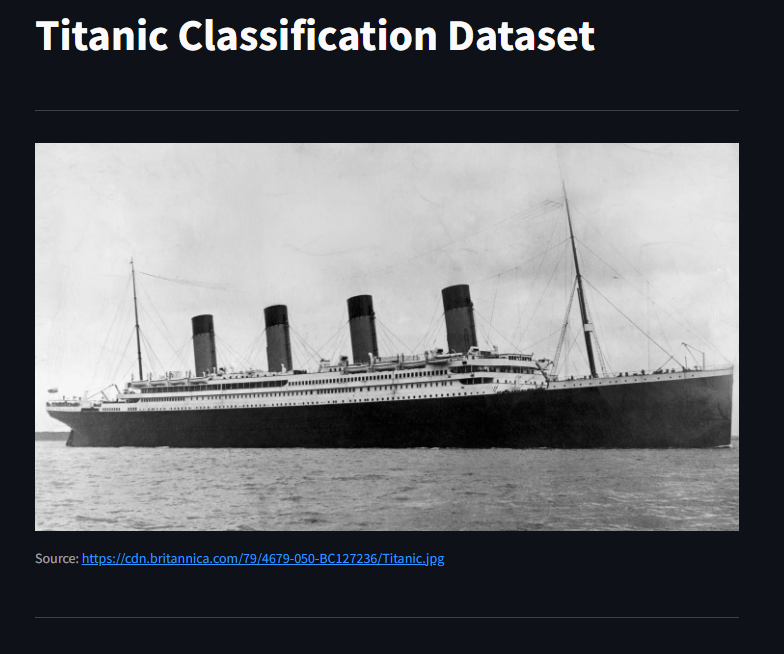
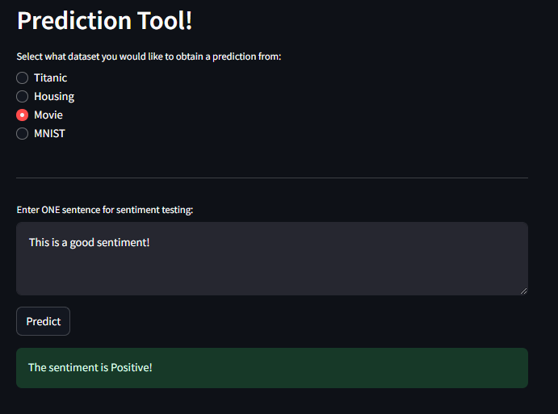

# Data Science Web Application

Welcome to the Data Science Web Application! This app allows users to explore various datasets, utilize machine learning techniques, and make predictions through an interactive web interface.

## Table of Contents
- [Datasets](#datasets)
- [Technologies](#technologies)
- [Machine Learning Techniques](#machine-learning-techniques)
- [Interactive Prediction Tools](#prediction-tools)
- [Setup and Installation](#setup-and-installation)
- [Usage](#usage)
- [Screenshots](#screenshots)

## Datasets
This application utilizes the following datasets:
- **IMDB Dataset**: A collection of 50,000 movie reviews used for sentiment analysis.
- **Titanic Dataset**: Passenger data used to predict survival on the Titanic.
- **Ames Housing Dataset**: Real estate data from Ames, Iowa, used for housing price prediction.
- **MNIST Dataset**: A large database of handwritten digits used for image classification.

## Technologies
The application is built using the following technologies:
- **Streamlit**: The app interface is presented using Streamlit for an interactive user experience.
- **Flask**: Backend routing is managed through Flask, connecting the frontend to the models for predictions and the SQLite database.
- **SQLite Database**: A lightweight database solution used to store and query the datasets mentioned above.
- **Docker Compose**: Manages the multi-container setup, ensuring all services (Streamlit, Flask, SQLite) are orchestrated and run smoothly together in isolated environments.

## Machine Learning Techniques
This app showcases several machine learning techniques, including:
- **Ensemble Techniques**: Methods that combine multiple models to improve accuracy and robustness.
  - *Examples*: Bagging, Boosting, Stacking
- **Unsupervised Learning**: Techniques used to find patterns in data without labeled outcomes.
  - *Examples*: Clustering, Dimensionality Reduction, Anomaly Detection

### TensorFlow vs. PyTorch
- **TensorFlow**: Shorter and easier to implement, ideal for rapid development and deployment.
- **PyTorch**: Offers more customizability, making it a preferred choice for researchers and developers who need finer control over model behavior.

## Interactive Prediction Tools
Explore various prediction tools available in the app:
- **Handwritten Digit Recognition**: A drawable canvas for predicting numbers from the MNIST dataset.
- **Sentiment Analysis**: Analyze movie reviews from the IMDB dataset to predict sentiment.
- **Titanic Survival Prediction**: Predict your chances of survival if you were aboard the Titanic.
- **Housing Price Calculator**: Estimate current housing prices in Ames, Iowa, using historical data.

## Setup and Installation
To run the application locally, follow these steps:

1. **Clone the Repository**:
    ```bash
    git clone https://github.com/DomenickD/DataScience-IEX-USF.git
    ```
    
2. **Navigate to the Project Directory**:
    ```bash
    cd Final_Project
    ```

3. **Run Docker Compose**:
    ```bash
    docker-compose up --build
    ```
    This command will build and start all the necessary containers (Streamlit, Flask, SQLite).
    Ensure your Docker Desktop is running before this command.

4. **Access the Application**:
    Once the containers are running, you can access the application by navigating to `http://localhost:8501` in your web browser.

## Usage
- **Navigate through the App**: Use the sidebar to switch between different datasets and prediction tools.
- **Interact with the Data**: Try out various machine learning techniques and see the predictions in real-time.

## Screenshots
Include screenshots of different sections of the application here:

1. **Home Page**
   
   

---

2. **Query Tool - Titanic**
   
   
   
   
   
   
   
   
   
   
   
   

---

3. **Query Tool - Housing**
   
   
   
   
   
   
   
   
   

---

4. **Query Tool - Movie Data (IMDB)**
   
   
   
   

---

5. **Neural Network Comparison**
   
   
   
   
   
   

---

6. **Ensemble Techniques**
   
   
   
   

---

7. **Unsupervised Techniques**
   
   
   

---
8. **Prediction Tool - Titanic**
   
   
   
   

---

9. **Prediction Tool - Housing**
   
   
   

---

10. **Prediction Tool - Sentiment Analysis**
   
   

---

11. **Prediction Tool - MNIST**
   
   
   


---