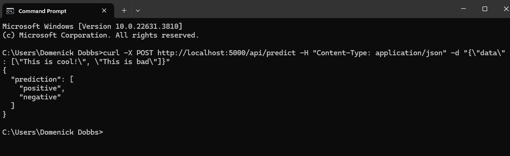

# My first Flask API

The purpose of this API is to provide a trained Logistic Regression Model for Sentiment Analysis an interactive way to use the model for new information and queries. 

### To use this API:

1. Clone the repository.

2. Install the requirements from the ```requirements.txt```.

3. Run the app.py file ```python app.py```.

4. Open the http://127.0.0.1:5000 in your browser.

5. Use the textbox on screen to input your sentences seperate by a new line to get sentiment on multiple statements.

6. Hit send and observe the predictions. The output will show json for "prediction" followed by "positive" or "negative" represented in teh order of your input.

7. (Optional) Use postman to use the API. See picture below. 

---

## It should look like this when run. 


