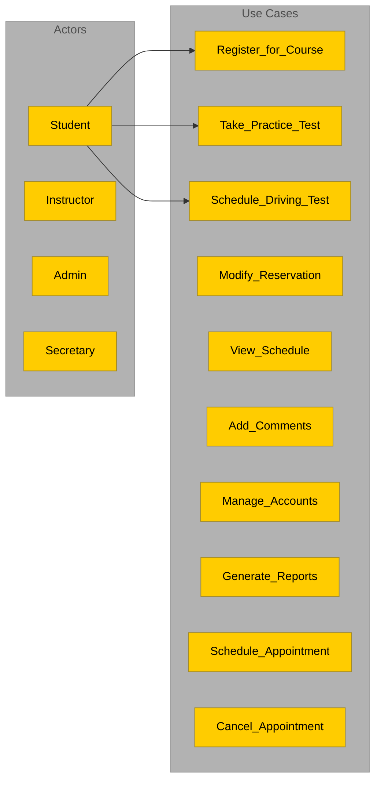
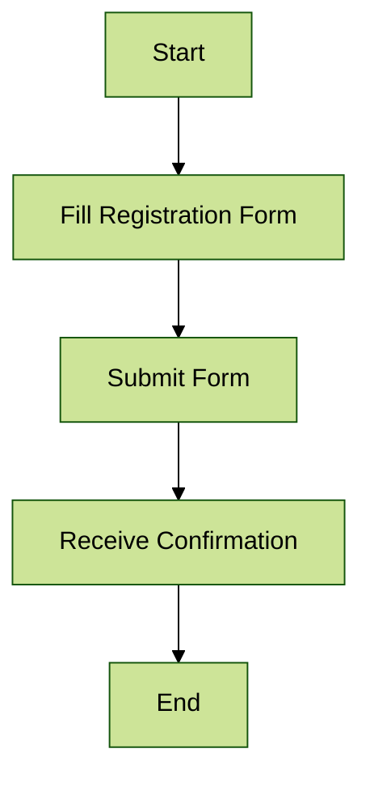
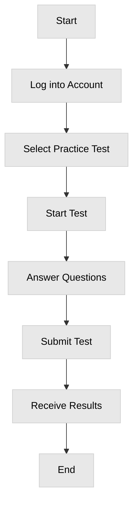
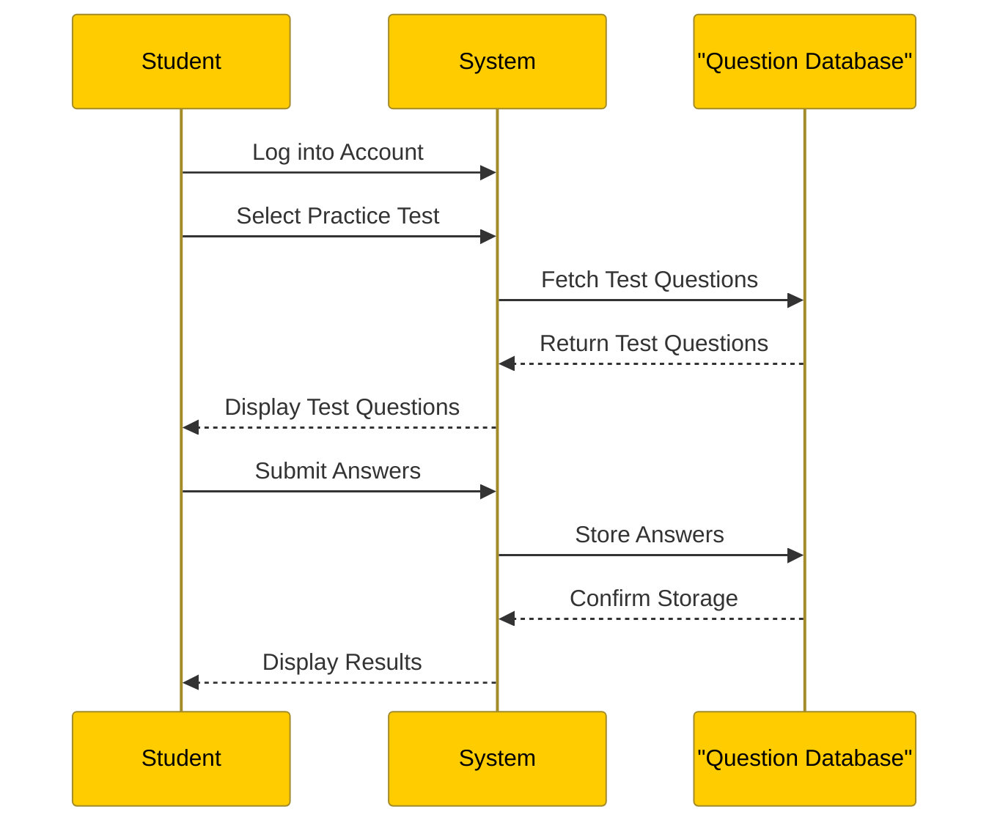
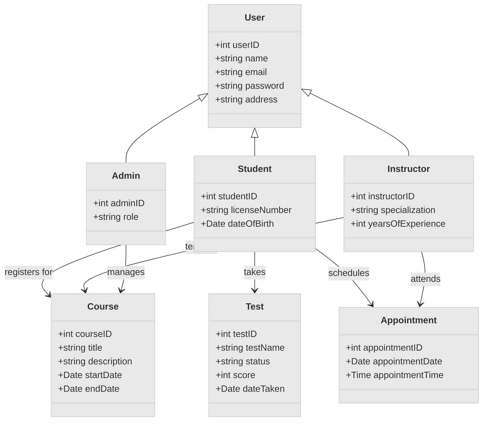

# DriverPass System UML Diagrams

## Use Case Diagram

# DriverPass System UML Diagrams

## Use Case Diagram

## Activity Diagram for "Register for Course"

## Activity Diagram for "Take Practice Test"

## Sequence Diagram for "Register for Course"

## Class Diagram

