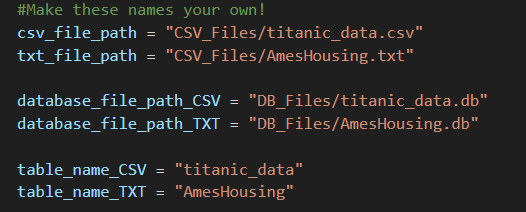

# CSV & TXT to SQLite3 Database Converter & Query Tool

This Python project provides a streamlined way to:

- Convert CSV files into SQLite3 databases.
- Convert tab-delimited TXT files into SQLite3 databases.
- Create tables within the database.
- Insert data from the files into the tables.
- Execute SQL queries against the database.
- Display query results in a Pandas DataFrame.

### Key Features

**Flexibility**: Handles CSV and tab-delimited TXT file formats.
Pandas Integration: Outputs query results directly into a Pandas DataFrame for easy analysis.
**SQLite3**: Leverages the lightweight, file-based SQLite3 database for convenience.
Prerequisites

**Python 3.12**
**SQLite3** (included with Python)
**Pandas** library (pip install pandas)
### Installation

Clone this repository:
```Bash
git clone https://https://github.com/DomenickD/DataScience-IEX-USF/tree/main/SQL_Intro.git
```


Install required libraries:
```Bash
pip install pandas
```
### Usage

- Place your CSV and TXT files in the project directory.
- Modify the configuration variables within the Python script (e.g., file names, table names, column names).
- Run the Python script:

```Bash
python converted_script.py
```

- Follow the prompts to specify the file type, table name, etc.
- Review the output in your terminal (query results displayed in a Pandas DataFrame).

###

Find this code and change it to support your project.



