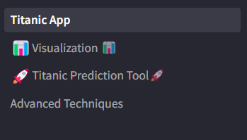
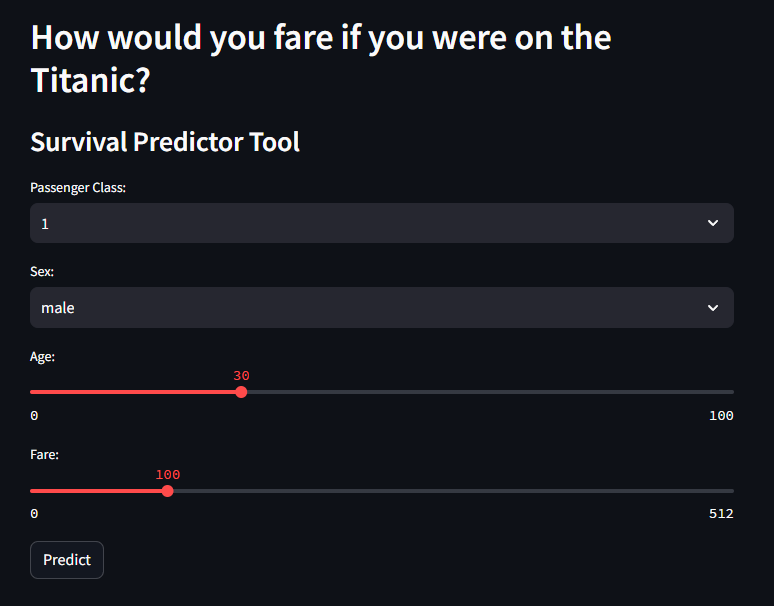

# Titanic Passenger Survival Analysis

## **Introduction**

This Streamlit application is an interactive exploration of the Titanic passenger survival dataset. It allows users to input passenger characteristics and predict their likelihood of survival based on a trained machine learning model. Additionally, the app visualizes survival patterns across different passenger classes.

## Running the Project

**1. Requirements**

* Python 3.12
* Streamlit (`pip install streamlit`)
* Pandas (`pip install pandas`)
* Pickle (`pip install pickle`) - for loading the pre-trained model
* Plotly (`pip install plotly`) - for interactive charts
* Numpy (`pip install numpy`)
* Matplotlib (`pip install matplotlib`)
* Seaborn (`pip install seaborn`) - Heatmaps
* Scikit-learn (`pip install scikit-learn`)

**2. Running with Docker**

(Assuming you have Docker installed)

* Build the Docker image:

```docker build -t titanic_survival_analysis .```

* Run the container:

```docker run -p 8501:8501 titanic_survival_analysis```

Open http://localhost:8501 in your web browser to access the Streamlit app.

**3. Running Locally**

* Clone this repository.

* Install the required libraries (pip install -r requirements.txt).

* Run the app using:

```streamlit run Titanic_app.py```

## Navigating the App

Once the app is running, you will see the left side of the screen will have a navigation bar.



You will start on the "Titanic app" page which will display summary information on the data, features, model, and scaling functions used. 


---

Naviagting to the visualization page will display a searchable dataframe that will count the number of results from each search. Below that there will be various plots to represent the data in relation to survivability. 


---

The prediction tool has a few sliders that will allow you to input your own data for what class passenger you would be, your sex, your age, and approx. how much you would have spent on the fare to board the Titanic. This data will be entered in the model to give a prediction on whether or not you would have survived the titanic. 




## Conclusions

* First Class Passengers had a higher chance of survival.

* Women and children had a higher chance of survival.

* Survival chance decreased with age.

* The higher the fare that was paid, the better chance of survival. 
